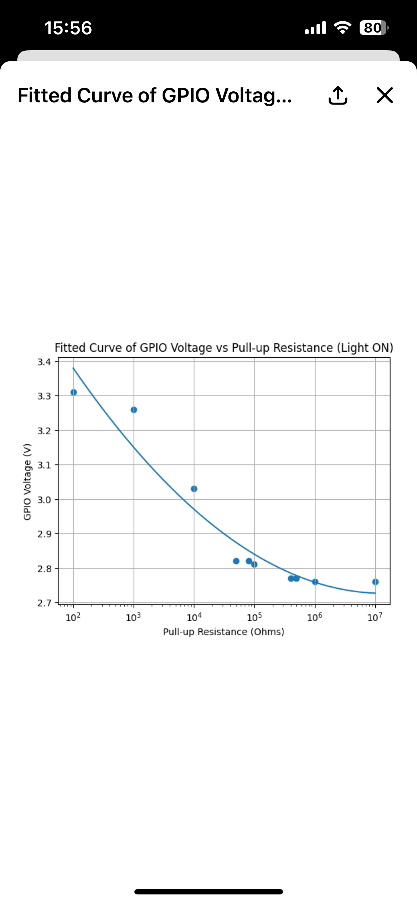

# 2026-03-18 Engineering Log

## Goal
Validate whether the phototransistor approach can reliably distinguish purifier indicator light states.

## Facts
- Tested phototransistor with adjustable pull-up resistance using a resistor box
- Observed that voltage change began to saturate when resistance exceeded about 500kΩ to 1MΩ
- Voltage separation between light conditions remained insufficient for reliable digital detection

## Interpretation
Under the current light intensity, the phototransistor approach is close to its practical limit. Increasing pull-up resistance does not significantly improve signal separability.

## Decisions
- Pause the phototransistor route
- Test a photoresistor-based sensing route
- Use analog sensing plus ADC instead of direct digital thresholding
- Introduce a resistor network to shift voltage into a better ADC range

## Next Actions
- Test photoresistor sensitivity under real light conditions
- Measure voltage difference between light and dark states
- Design and verify voltage shifting network for ESP32-C3 ADC
